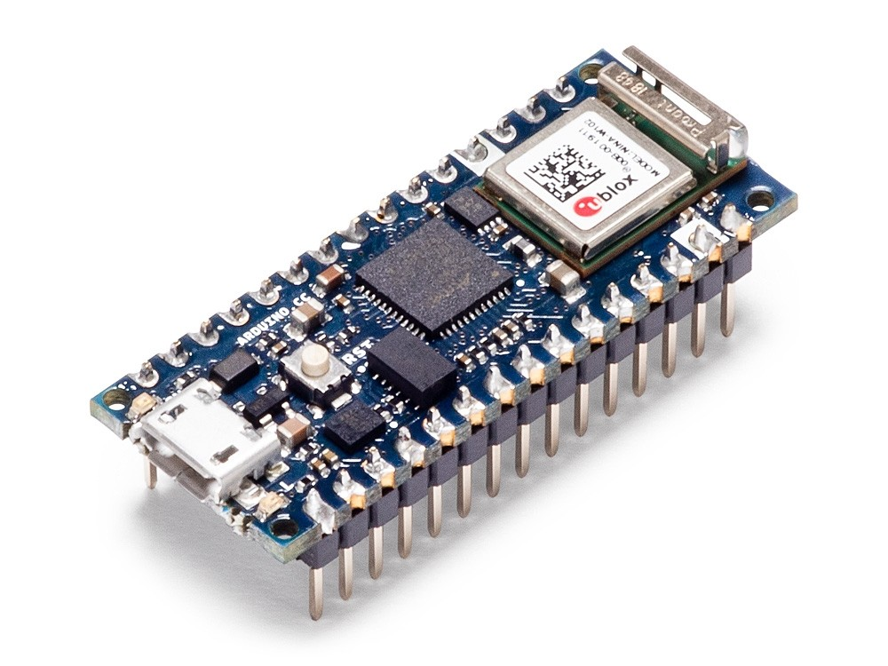
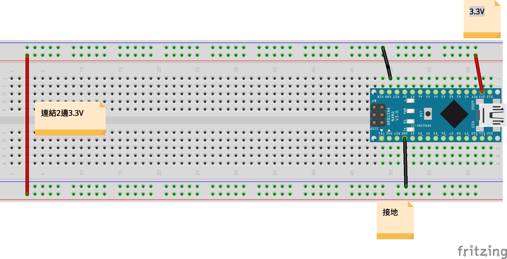
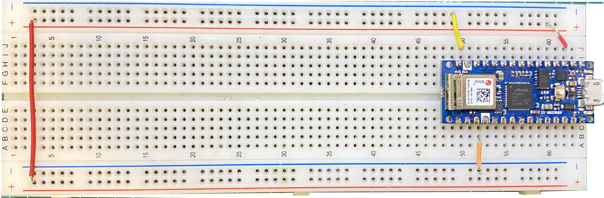
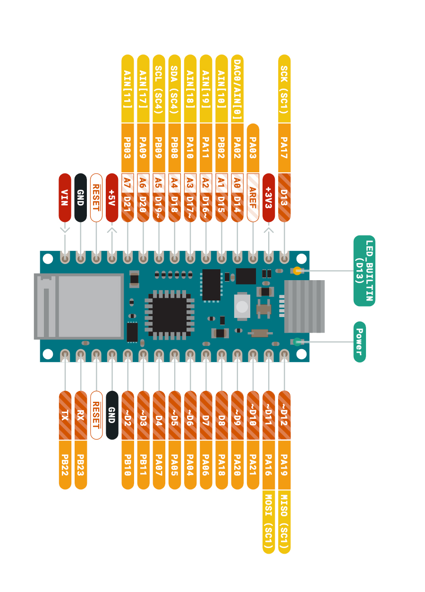
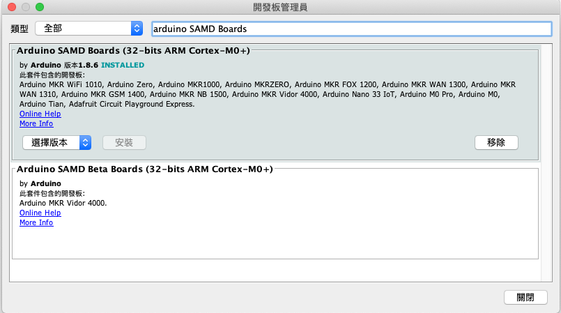
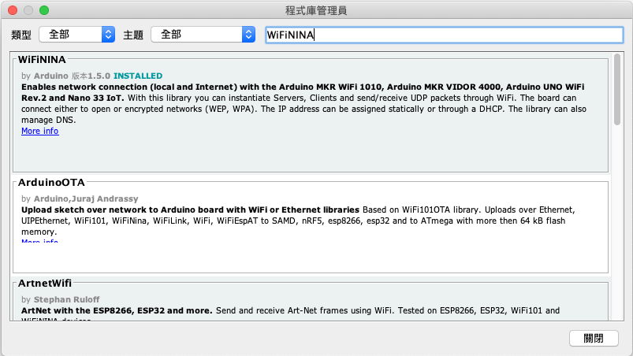
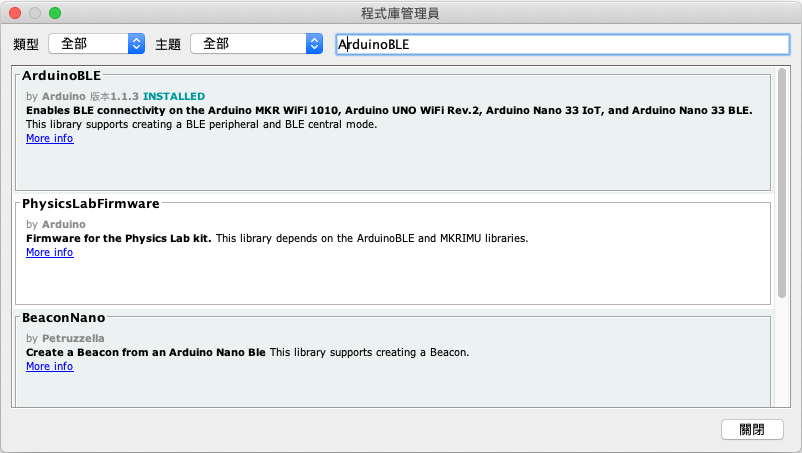
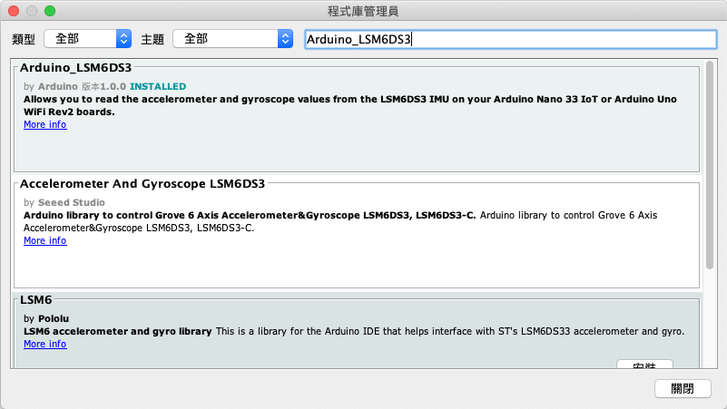

# 智慧家庭
## 一般操作
1. [上拉電阻](https://github.com/roberthsu2003/smartHome/tree/master/%E4%B8%80%E8%88%AC%E6%93%8D%E4%BD%9C/1%E4%B8%8A%E6%8B%89%E9%9B%BB%E9%98%BB)

2. [bit操控Led](https://github.com/roberthsu2003/smartHome/tree/master/%E4%B8%80%E8%88%AC%E6%93%8D%E4%BD%9C/2bitLed)

3. [事件導向](https://github.com/roberthsu2003/smartHome/tree/master/%E4%B8%80%E8%88%AC%E6%93%8D%E4%BD%9C/3%E4%BA%8B%E4%BB%B6%E5%B0%8E%E5%90%91/1%E9%96%93%E9%9A%94%E6%99%82%E9%96%93%E5%9F%B7%E8%A1%8C)

4. [陀螺儀感測](https://github.com/roberthsu2003/smartHome/tree/master/%E4%B8%80%E8%88%AC%E6%93%8D%E4%BD%9C/4%E9%99%80%E8%9E%BA%E5%84%80%E6%84%9F%E6%B8%AC)

5. [xyz軸感測](https://github.com/roberthsu2003/smartHome/tree/master/%E4%B8%80%E8%88%AC%E6%93%8D%E4%BD%9C/5xyz%E8%BB%B8%E6%84%9F%E6%B8%AC)

## Blynk網路服務
1. [手機控制LED動作](https://github.com/roberthsu2003/smartHome/tree/master/%E4%BD%BF%E7%94%A8Blynk/1led_control)

2. [手機顯示可變電阻動作](https://github.com/roberthsu2003/smartHome/tree/master/%E4%BD%BF%E7%94%A8Blynk/2%E5%8F%AF%E8%AE%8A%E9%9B%BB%E9%98%BB)

3. [手機顯示環境音量](https://github.com/roberthsu2003/smartHome/tree/master/%E4%BD%BF%E7%94%A8Blynk/3%E8%81%B2%E9%9F%B3%E6%84%9F%E6%B8%AC%E5%99%A8(%E4%B8%8D%E6%BA%96))

4. [手機當作門窗防盜器](https://github.com/roberthsu2003/smartHome/tree/master/%E4%BD%BF%E7%94%A8Blynk/4%E8%BF%B7%E4%BD%A0%E7%A3%81%E7%B0%A7%E9%96%8B%E9%97%9C)

## 及時資料庫
1. [網頁顯示LED狀態](https://github.com/roberthsu2003/smartHome/tree/master/%E5%8F%8A%E6%99%82%E8%B3%87%E6%96%99%E5%BA%AB/1led_control)

2. [網頁監控觸控裝置](https://github.com/roberthsu2003/smartHome/tree/master/%E5%8F%8A%E6%99%82%E8%B3%87%E6%96%99%E5%BA%AB/2touch_sensor)

3. [網頁監控環境溫溼度](https://github.com/roberthsu2003/smartHome/tree/master/%E5%8F%8A%E6%99%82%E8%B3%87%E6%96%99%E5%BA%AB/3dht11) 

## LihgtBlue手機藍牙app
1. 手機藍牙控制LED

## IFTTT服務
1. Arduino發送溫溼度訊息給line群組

## ThingSpeak web Service
1.收集資料，繪制圖表

## mackerel.io 服數
1.及時監控服務平台

## Arduino當作WebServer
1.Web Service

## 使用arduino nano 33 iot說明

#### 跳線線路圖

#### 跳線麵包板

#### pin腳

#### 開發板管理員

#### 程式庫管理員
- wifi  

- 藍牙   

- 陀螺儀和加速度計(LSM6DS3)  

#### arduino naon 33 iot 說明文件
https://content.arduino.cc/assets/Pinout-NANO33IoT_latest.pdf
