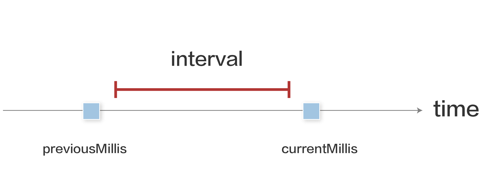

# 計時器(不使用delay())
## 學習如何建立計時器
- ### delay()會使程式的流程中止, 如果有多個元件控制,delay()將影響其它元件的運行。

- 演算法



### 線路圖


```C++
/*
	timer.ino
  Blink without Delay

  Turns on and off a light emitting diode (LED) connected to a digital pin,
  without using the delay() function. This means that other code can run at the
  same time without being interrupted by the LED code.

  The circuit:
  - Use the onboard LED.
  - Note: Most Arduinos have an on-board LED you can control. On the UNO, MEGA
    and ZERO it is attached to digital pin 13, on MKR1000 on pin 6. LED_BUILTIN
    is set to the correct LED pin independent of which board is used.
    If you want to know what pin the on-board LED is connected to on your
    Arduino model, check the Technical Specs of your board at:
    https://www.arduino.cc/en/Main/Products

  created 2005
  by David A. Mellis
  modified 8 Feb 2010
  by Paul Stoffregen
  modified 11 Nov 2013
  by Scott Fitzgerald
  modified 9 Jan 2017
  by Arturo Guadalupi

  This example code is in the public domain.

  https://www.arduino.cc/en/Tutorial/BuiltInExamples/BlinkWithoutDelay
*/

// constants won't change. Used here to set a pin number:
const int ledPin =  LED_BUILTIN;// the number of the LED pin

// Variables will change:
int ledState = LOW;             // ledState used to set the LED

// Generally, you should use "unsigned long" for variables that hold time
// The value will quickly become too large for an int to store
unsigned long previousMillis = 0;        // will store last time LED was updated

// constants won't change:
const long interval = 1000;           // interval at which to blink (milliseconds)

void setup() {
  // set the digital pin as output:
  pinMode(ledPin, OUTPUT);
}

void loop() {
  // here is where you'd put code that needs to be running all the time.

  // check to see if it's time to blink the LED; that is, if the difference
  // between the current time and last time you blinked the LED is bigger than
  // the interval at which you want to blink the LED.
  unsigned long currentMillis = millis();

  if (currentMillis - previousMillis >= interval) {
    // save the last time you blinked the LED
    previousMillis = currentMillis;

    // if the LED is off turn it on and vice-versa:
    if (ledState == LOW) {
      ledState = HIGH;
    } else {
      ledState = LOW;
    }

    // set the LED with the ledState of the variable:
    digitalWrite(ledPin, ledState);
  }
}

```

```C++
//timer with function
#define ledPin  LED_BUILTIN

void setup() {
  pinMode(ledPin, OUTPUT);
}

void loop() {
  blinkOfLed();
}

void blinkOfLed() {
  static int ledState = LOW;
  static unsigned long previousMillis = 0;
  const long interval = 1000;
  unsigned long currentMillis = millis();
  if (currentMillis - previousMillis >= interval) {
    // save the last time you blinked the LED
    previousMillis = currentMillis;


    if (ledState == LOW) {
      ledState = HIGH;
    } else {
      ledState = LOW;
    }
    digitalWrite(ledPin, ledState);
  }
}

```

```c++
//timerWithBlynkTimer

#include <BlynkSimpleWiFiNINA.h>
#define ledPin  LED_BUILTIN
BlynkTimer timer;
bool ledState = LOW;

void setup()
{
  Serial.begin(9600);
  pinMode(ledPin,OUTPUT);
  timer.setInterval(1000L, myTimerEvent);
}

void loop()
{
  timer.run();
}

void myTimerEvent()
{
  if (ledState == LOW) {
    ledState = HIGH;
  } else {
    ledState = LOW;
  }
  digitalWrite(ledPin, ledState);
}
```

