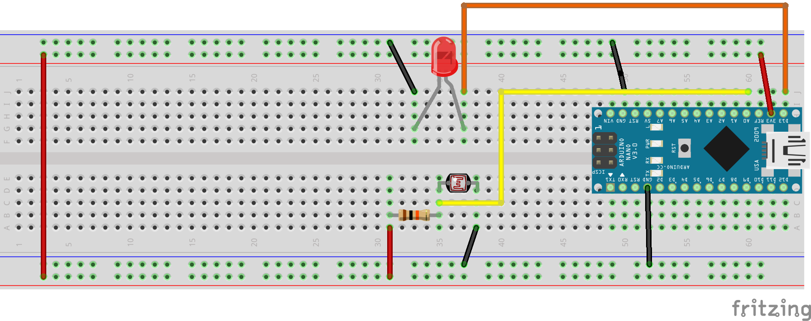
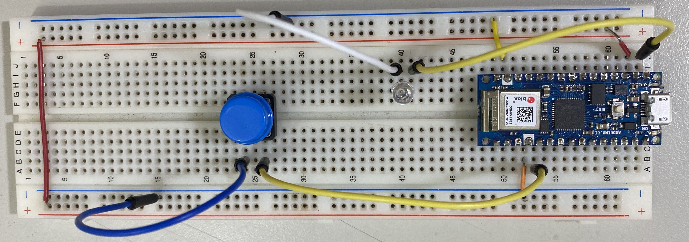

# 光敏電阻
## 學習如何使用光敏電阻

- ### 分壓計算[網站](https://www.digikey.tw/zh/resources/conversion-calculators/conversion-calculator-voltage-divider)


### 線路圖


### 實體線路圖


### 上拉電阻接線
[](https://youtu.be/y28I-Kwlljg)

### 上拉電阻成品展示
[](https://youtu.be/_LYhqSXSdy8)


```C++
#define btn 2
#define led 13

void setup() {
  // put your setup code here, to run once:
  Serial.begin(9600);
  pinMode(btn, INPUT_PULLUP);
  pinMode(led, OUTPUT);
}

void loop() {
  // put your main code here, to run repeatedly:
  int sensorVal = digitalRead(btn);
  if(sensorVal == LOW)
    digitalWrite(led,HIGH);
  else
    digitalWrite(led,LOW);
}
```

