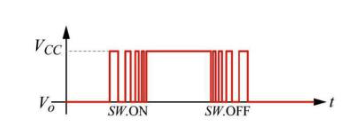
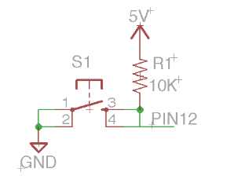
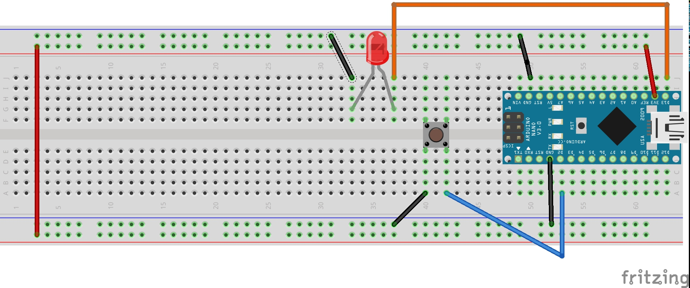
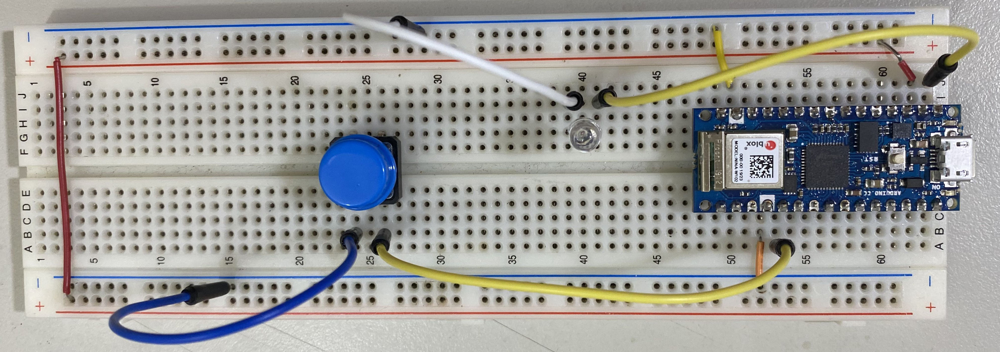

# 上拉電阻
## 學習何時使用上拉電阻

- ### 上拉電阻可以解決彈跳問題

按鈕是一個機械動作，在你按下按鈕那零點幾秒內，Arduino實際上是收到很多HIGH和LOW的信號，這種在HIGH和LOW之間跳動的現像我們稱之為彈跳。
即使你沒按下按鈕，引腳12也是會持續收到彈跳信號。



- ### 按鈕使用上拉電阻,PIN12接收訊號的說明圖




### 線路圖


### 實體線路圖


### 上拉電阻接線
[](https://youtu.be/y28I-Kwlljg)

### 上拉電阻成品展示
[](https://youtu.be/_LYhqSXSdy8)


```C++
#define btn 2
#define led 13

void setup() {
  // put your setup code here, to run once:
  Serial.begin(9600);
  pinMode(btn, INPUT_PULLUP);
  pinMode(led, OUTPUT);
}

void loop() {
  // put your main code here, to run repeatedly:
  int sensorVal = digitalRead(btn);
  if(sensorVal == LOW)
    digitalWrite(led,HIGH);
  else
    digitalWrite(led,LOW);
}
```

