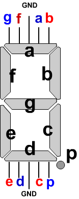
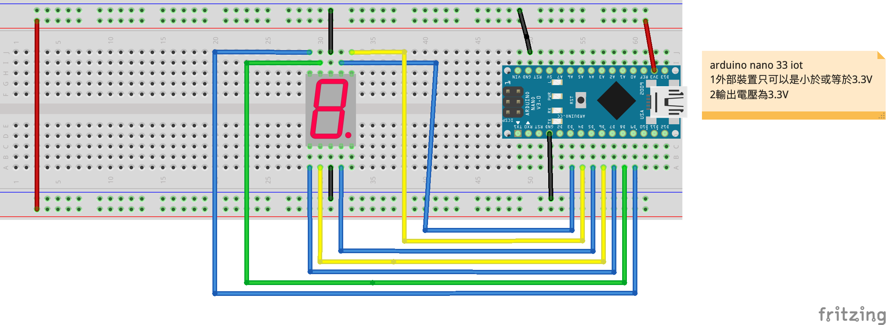

# 7段顯示器
## 學習如何操控7段顯示器
- 七段顯示器分成共陽極和共陰極兩種，不管是哪一種，內部構造都是由 8 個 LED 發光二極體所組成，其中七個是筆劃，另外一個是小數點，如下圖所示，依順時針方向分別為 a, b, c, d, e, f, g 以及小數點 dp (decimal point):


- 要產生數字，方法是點亮指定的 LED。例如要產生數字 0，便點亮 a, b, c, d, e, f 等節段；要產生數字 1，便點亮 b, c 等節段；要產生數字 2，便點亮 a, b, d, e, g 等節段，依此類推。以共陰極而言，0 到 9 這十個阿拉伯數字與各節段的對應表如下：

| 顯示數字 | dp | a | b | c | d | e | f | g |
|:--|:--|:--|:--|:--|:--|:--|:--|:--|
| 0 | 0 | 1 | 1 | 1 | 1 | 1 | 1 | 0 | 
| 1 | 0 | 0 | 1 | 1 | 0 | 0 | 0 | 0 |  
| 2 | 0 | 1 | 1 | 0 | 1 | 1 | 0 | 1 |  
| 3 | 0 | 1 | 1 | 1 | 1 | 0 | 0 | 1 |  
| 4 | 0 | 0 | 1 | 1 | 0 | 0 | 1 | 1 |  
| 5 | 0 | 1 | 0 | 1 | 1 | 0 | 1 | 1 |  
| 6 | 0 | 1 | 0 | 1 | 1 | 1 | 1 | 1 | 
| 7 | 0 | 1 | 1 | 1 | 0 | 0 | 0 | 0 |
| 8 | 0 | 1 | 1 | 1 | 1 | 1 | 1 | 1 |
| 9 | 0 | 1 | 1 | 1 | 1 | 0 | 1 | 1 | 

### 7段顯示器pin腳對應圖



### 線路圖


### 接線成品


### 7段顯示器展示
[](https://youtu.be/Zd1pAQSc4Q8)

```C++
/*
 * g = digital 9
 * f = digital 8
 * e = digital 7
 * d = digital 6
 * c = digital 5
 * b = digital 4
 * a = digital 3
 */
byte pins[] = {9, 8, 7, 6, 5, 4, 3}; //g,f,e,d,c,b,a
byte pinCount = 7;

/*
 * numbers[10]內儲存的顯示數值依序是0,1,2,3,4,5,6,7,8,9
 * B01111110代表的是要顯示數值，
 * 最後的0代表的是g要輸出0
 * 倒數第2個值是1,是f要輸出1
 */
byte numbers[10] = {B01111110,B00110000,B01101101,B01111001,B00110011,B01011011,B01011111,B01110000,B01111111,B01111011};

void setup() {
  Serial.begin(9600);
  for(int i=0;i<pinCount;i++){
    pinMode(pins[i],OUTPUT);
  }
  
}

void loop() {
  
  //Serial.println(numbers[0]);
  //Serial.println(bitRead(numbers[0],6));
  
  for(int i=0;i<10;i++){
    for(int j=0; j<=6; j++){
      bool state = bitRead(numbers[i],j); //j是0,代表抓最右邊的數值
      digitalWrite(pins[j],state);
    }
    delay(1000);
  }  
}
```

