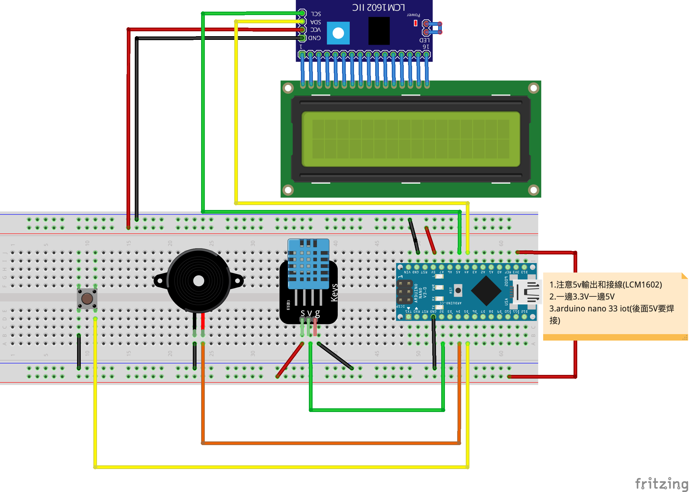

# LCM1602_LM35溫度感測

- ### LCM1602至程式庫管理員下載LiquidCrystal_I2C


- ### compiler時有警告,可以忽略。
- ### 接線時使用3.3V，文字會不清礎。可以使用5V，但Arduino nano iot 33要有焊接5V的端點，才可以從USB傳送5V的電壓

- ### 有源蜂鳴器
	- 有源蜂鳴器是內建了一組固定的頻率，只要接通電源，就會發出固定的音調。

- ### 無源蜂源器
	- 無源蜂源器則不同，我們必須透過程式，告訴它頻率，我們才能得到所需的音調，但我們就可以利用它來播放簡單的旋律了！

- ### DHT11 至程式庫管理員下載DHT11 library


### arduino nano 33 iot


### 線路圖


### 接線成品


```C++
#include "DHT.h"
#include <Wire.h> 
#include <LiquidCrystal_I2C.h>

#define DHTPIN 2 
#define BUZZER 4    

#define DHTTYPE DHT11   // DHT 11
//#define DHTTYPE DHT22   // DHT 22  (AM2302), AM2321
//#define DHTTYPE DHT21   // DHT 21 (AM2301)

LiquidCrystal_I2C lcd(0x27,20,4);  // set the LCD address to 0x27 for a 16 chars and 2 line display
DHT dht(DHTPIN, DHTTYPE);

void setup() {  
  Serial.begin(9600);
  pinMode(DHTPIN, INPUT);
  pinMode(BUZZER, OUTPUT);
  //dht要初始化
  dht.begin();
  //lcd要初始化
  lcd.init();
}

void loop() {
  //DHT11速度慢，隔2秒讀一次
  delay(2000);

  //響一聲
  tone(BUZZER, 4978, 500);
  
  
  // Reading temperature or humidity takes about 250 milliseconds!
  // Sensor readings may also be up to 2 seconds 'old' (its a very slow sensor)
  float h = dht.readHumidity();
  // Read temperature as Celsius (the default)
  float t = dht.readTemperature();
  // Read temperature as Fahrenheit (isFahrenheit = true)
  float f = dht.readTemperature(true);

  // Check if any reads failed and exit early (to try again).
  if (isnan(h) || isnan(t) || isnan(f)) {
    Serial.println(F("Failed to read from DHT sensor!"));
    return;
  }

  // Compute heat index in Fahrenheit (the default)
  float hif = dht.computeHeatIndex(f, h);
  // Compute heat index in Celsius (isFahreheit = false)
  float hic = dht.computeHeatIndex(t, h, false);

  Serial.print(F("Humidity: "));
  Serial.print(h);
  Serial.print(F("%  Temperature: "));
  Serial.print(t);
  Serial.print(F("°C "));
  Serial.print(f);
  Serial.print(F("°F  Heat index: "));
  Serial.print(hic);
  Serial.print(F("°C "));
  Serial.print(hif);
  Serial.println(F("°F"));

  lcd.backlight();
  lcd.setCursor(0,0);
  lcd.print("H:"+String(f)+"%");
  lcd.setCursor(0,1);
  lcd.print("T:"+String(t)+"C");
}
```

