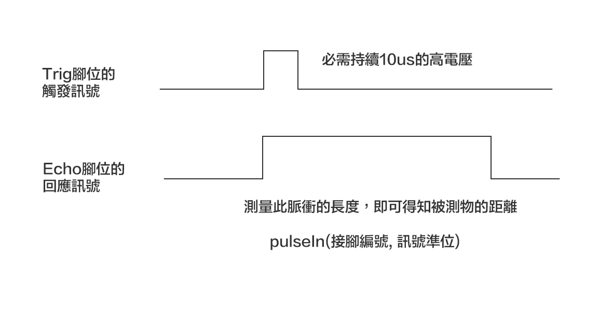
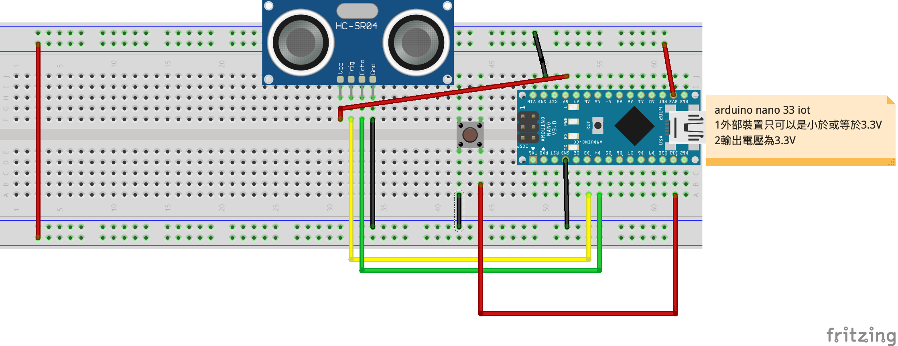
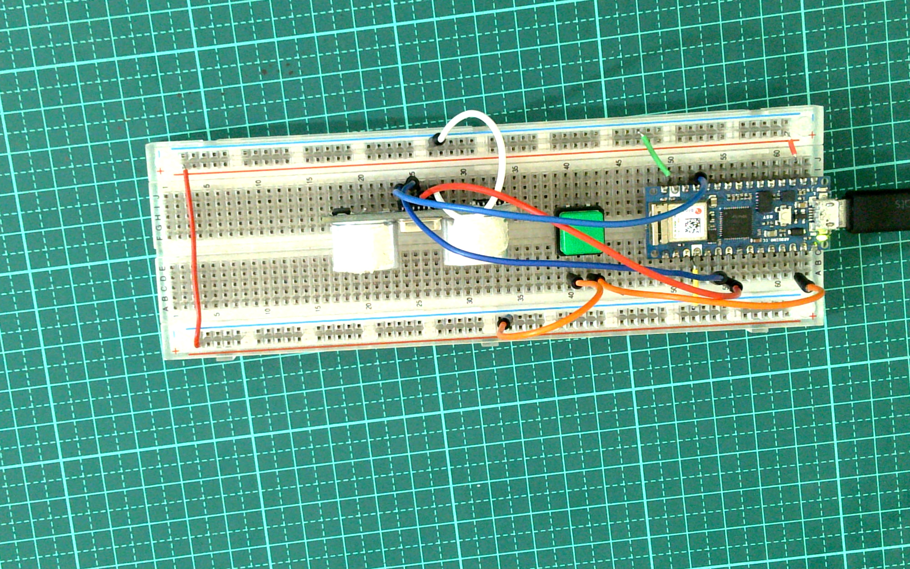

# HC-SR04超音波測距模組

- ### 模組工作原理

	- 採用I/O觸發測距，給至少為10us的高電位信號
	- 模組自動發送 8個 40KHZ的方波，自動檢測是否有信號返回
	- 有信號返回，通過I/O輸出一高電位，高電位持續的時間就是超聲波從發射到返回的時間
	- 測試距離 =（高電位時間 x 聲速（340M / S））/ 2
	- 1公分大約58.1us




- ### 支術規格
	- 電源：DC5V/2mA
	- 輸出電位( 1/ 0)：5V/ 0V
	- 精度：3mm
	- 距離範圍：2 ~ 450cm
	- 有效的角度：<15℃
	- 觸發輸入信號：10uS TTL pulse
	- ECHO輸出信號： Input TTL lever signal and the range in proportion
	- 接線方式：VCC、trig (控制端)、echo (接收端)、GND


- ### Arduino nano 33 iot 必需使用5V電壓才能作用HC-SR04


### 線路圖


### 接線成品


### 防異物入侵
[](https://youtu.be/nm4_FHjcfsw)


```C++
//按下按鈕，建立預設距離
#define BUTTON_PIN 11
#define TRIG_PIN 3
#define ECHO_PIN 4 
#define US 58

unsigned long cm;
volatile int defaultDistance=0;

void setup() {  
  Serial.begin(9600);
  pinMode(TRIG_PIN, OUTPUT);
  pinMode(ECHO_PIN, INPUT);  
  pinMode(BUTTON_PIN,INPUT_PULLUP);
  attachInterrupt(digitalPinToInterrupt(BUTTON_PIN),buttonPress,LOW) ;
}

void buttonPress(){
  defaultDistance = ping()/US;
  Serial.println("預設"+String(cm)+"cm");
}

unsigned long ping(){
  digitalWrite(TRIG_PIN,HIGH);
  delayMicroseconds(10);
  digitalWrite(TRIG_PIN,LOW);
  return pulseIn(ECHO_PIN, HIGH);
}

void loop() {
  cm = ping()/US;
  Serial.println(String(cm)+"cm");
  if(cm > defaultDistance+3 || cm < defaultDistance-3){
    Serial.println("有異物入侵");
  }
  delay(1000);
}
```

