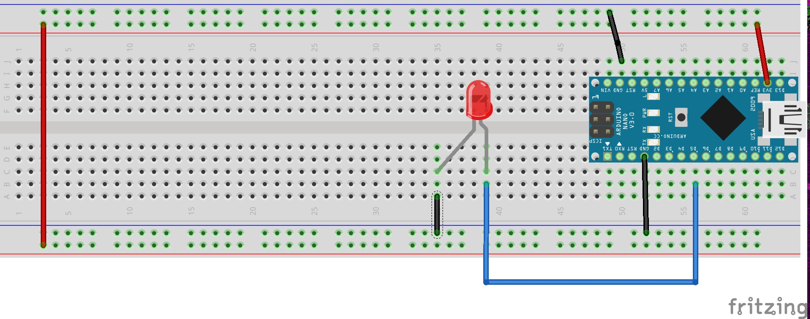
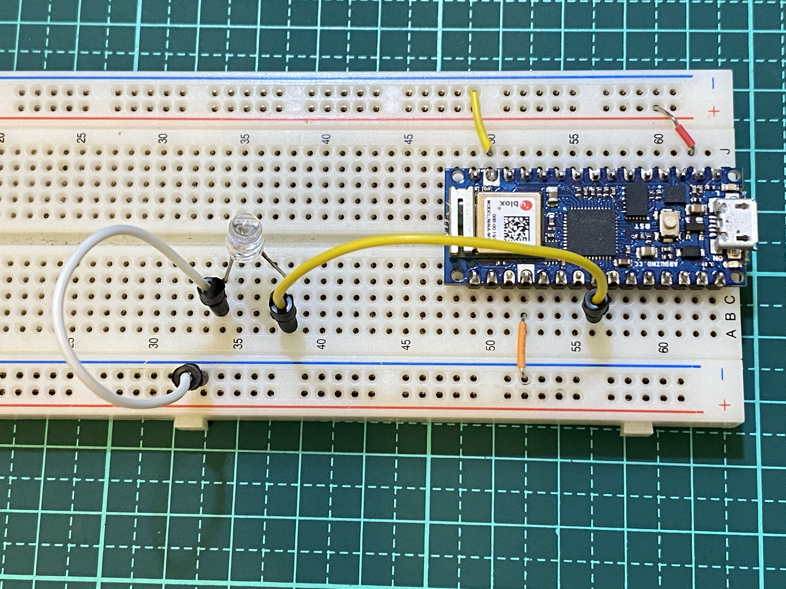

# 事件導向
## 學習如何善用事件導向
### 線路圖


### 實體線路圖


### 事件導向_間隔時間執行_成品展示
[](https://youtu.be/XptfalbqghI)


```C++
##################################
#安裝Eventually package
#
###################################

#include <Eventually.h>

/*
 * This is the standard blinky lights written using Eventually.
 * Just set LIGHT_PIN to whatever pin you have your LED attached to.
 */

#define LIGHT_PIN 5

EvtManager mgr;
bool state = LOW;

void setup() {
  pinMode(LIGHT_PIN, OUTPUT);
  mgr.addListener(new EvtTimeListener(1000, true, (EvtAction)blinkme)); 
}

bool blinkme() {
  state = !state; // Switch light states
  digitalWrite(LIGHT_PIN, state); // Display the state
  return false; // Allow the event chain to continue
}

USE_EVENTUALLY_LOOP(mgr) // Use this instead of your loop() function.
```

