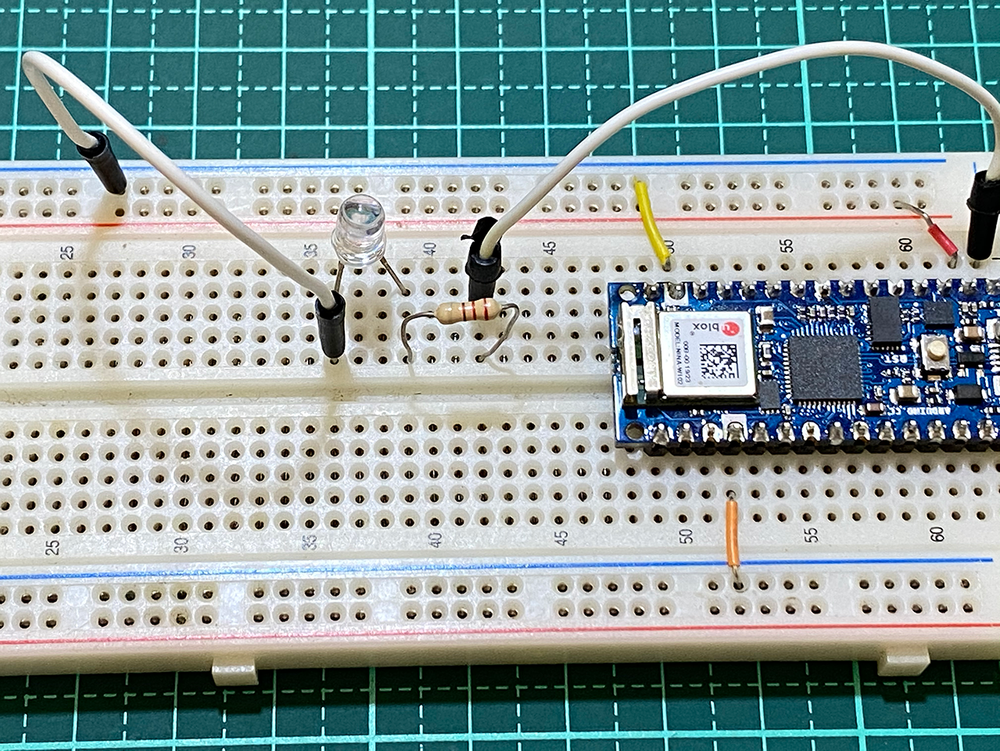
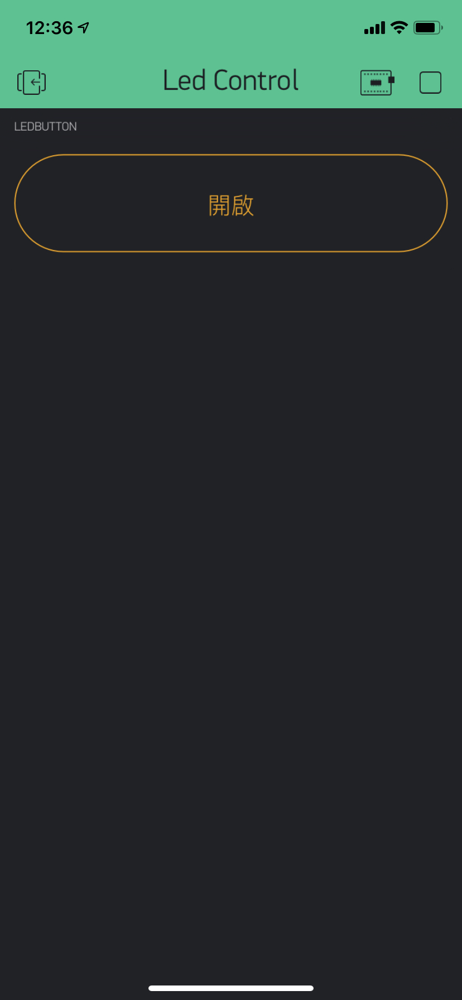

# LEDControl和Blynk
## 學習讓Arduino和Blynk手機App連線
### 線路圖


### 實體線路圖


### Blynk App內設定專案


### Blynk App專案畫面 


### Blynk App_LEDControl影片
[](https://youtu.be/RqtbHzIYp_Y)


```C++
/*************************************************************
  Download latest Blynk library here:
    https://github.com/blynkkk/blynk-library/releases/latest

  Blynk is a platform with iOS and Android apps to control
  Arduino, Raspberry Pi and the likes over the Internet.
  You can easily build graphic interfaces for all your````
  projects by simply dragging and dropping widgets.

    Downloads, docs, tutorials: http://www.blynk.cc
    Sketch generator:           http://examples.blynk.cc
    Blynk community:            http://community.blynk.cc
    Follow us:                  http://www.fb.com/blynkapp
                                http://twitter.com/blynk_app

  Blynk library is licensed under MIT license
  This example code is in public domain.

 *************************************************************
  This example shows how to use Arduino MKR 1010
  to connect your project to Blynk.

  Note: This requires WiFiNINA library
    from http://librarymanager/all#WiFiNINA

  Feel free to apply it to any other example. It's simple!
 *************************************************************/

/* Comment this out to disable prints and save space */
#define BLYNK_PRINT Serial

#include <SPI.h>
#include <WiFiNINA.h>
#include <BlynkSimpleWiFiNINA.h>
#include "data.h"

// You should get Auth Token in the Blynk App.
// Go to the Project Settings (nut icon).
char auth[] = AUTH;

// Your WiFi credentials.
// Set password to "" for open networks.
char ssid[] = SSID;
char pass[] = PASS;

void setup()
{
  // Debug console
  Serial.begin(9600);

  Blynk.begin(auth, ssid, pass);
  // You can also specify server:
  //Blynk.begin(auth, ssid, pass, "blynk-cloud.com", 80);
  //Blynk.begin(auth, ssid, pass, IPAddress(192,168,1,100), 8080);
}

void loop()
{
  Blynk.run();
}
```

