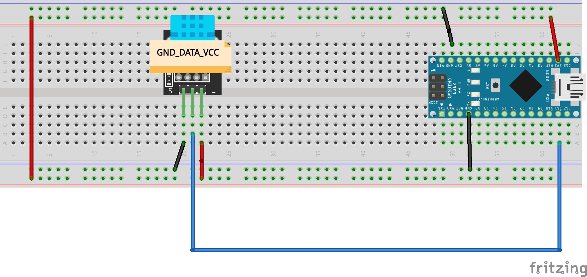
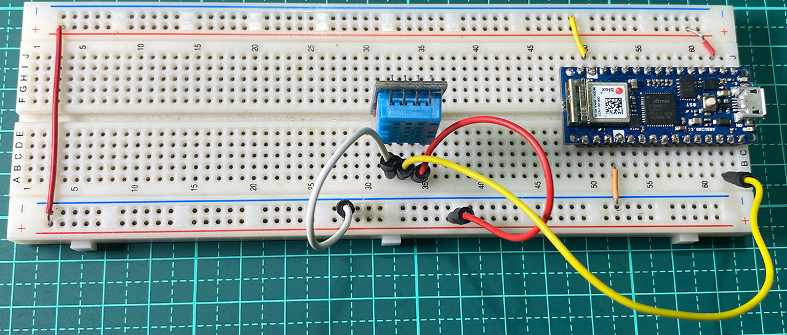
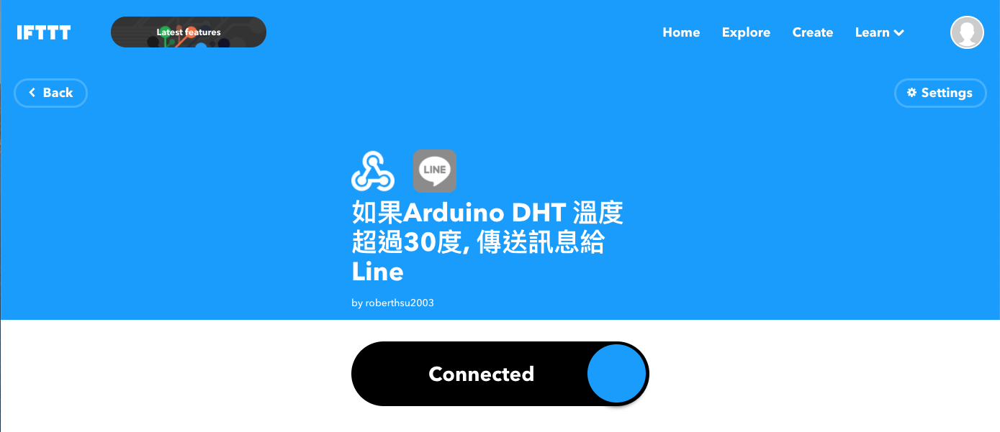

# 使用IFTTT讓Arduino發送溫溼度訊息給line群組
## 讓Arduino的DHT11發送訊息給WebHook,再由WebHook轉送給Line群組 
### 線路圖
[](led_control_bb.pdf)

### 實體線路圖


### 在IFTTT網站設立一個Applet



### Line溫濕度警告-測試群組


### 及時資料庫_溫濕度檢示影片
[](https://youtu.be/LHU0Ils3DUQ)


```C++
// 使用IFTTTu
// 使用arduino nano 33 iot

/*
 *連線Firebase realtimeDatabase
 *get節點資料
*/
#include <SPI.h>
#include <WiFiNINA.h>
#include "data.h"
#include "DHT.h"

#define dhtData 8

DHT dht(dhtData,DHT11);

void setup()
{
  Serial.begin(9600);
  delay(100);
  Serial.println();

  Serial.print("Connecting to Wi-Fi");
  int status = WL_IDLE_STATUS;
  while (status != WL_CONNECTED)
  {
    status = WiFi.begin(WIFI_SSID, WIFI_PASSWORD);
    Serial.print(".");
    delay(300);
  }
  Serial.println();
  Serial.print("Connected with IP: ");
  Serial.println(WiFi.localIP());
  Serial.println();  

  //DHTinit
  dht.begin();
}

 

void loop()
{
  float h = dht.readHumidity();//讀取濕度
  float t = dht.readTemperature();//讀取攝氏溫度
  float f = dht.readTemperature(true);//讀取華氏溫度
  if (isnan(h) || isnan(t) || isnan(f)) {
    Serial.println("無法從DHT傳感器讀取！");    
  }
  Serial.print("濕度: ");
  Serial.print(h);
  Serial.print("%\t");
  Serial.print("攝氏溫度: ");
  Serial.print(t);
  Serial.print("*C\t");
  Serial.print("華氏溫度: ");
  Serial.print(f);
  Serial.print("*F\n");
  
  delay(2000);
}
```

