## 周邊零件
1. ### 麵包板
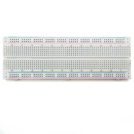

2. ### 40P 杜邦線 公-母 10CM

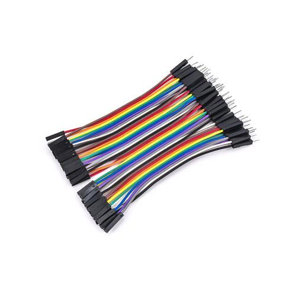

3. ### 40P 杜邦線 公-公 10CM

4. ### 40P 杜邦線 母-母 10CM

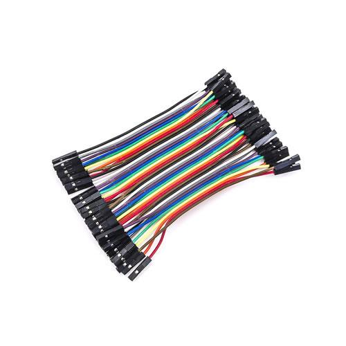 

5. ### 按壓開關 12X12 4PIN

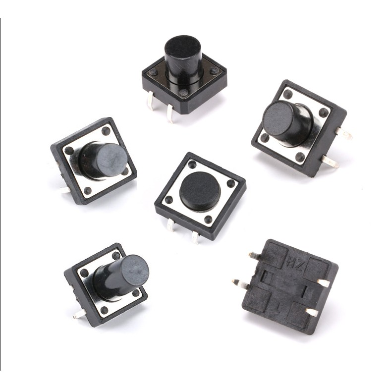

6. ### 電阻 1/4W 220歐姆

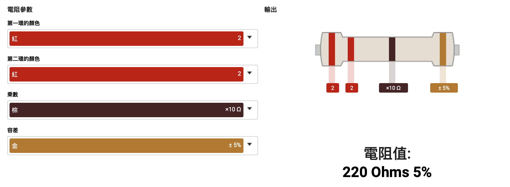

7. ### 電阻 1/4W 10K歐姆

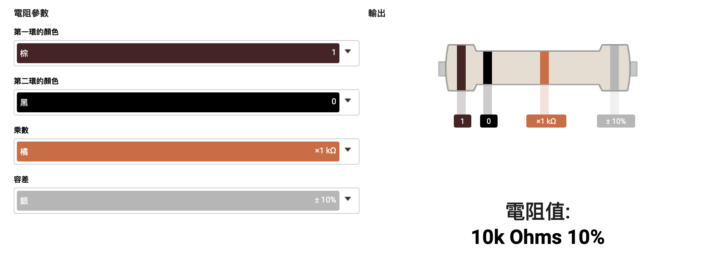

8. ### 電磁式有源蜂鳴器 3V 3.3V

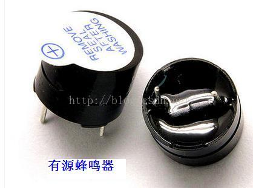

9. ### 可變電阻 VR16mm 10K

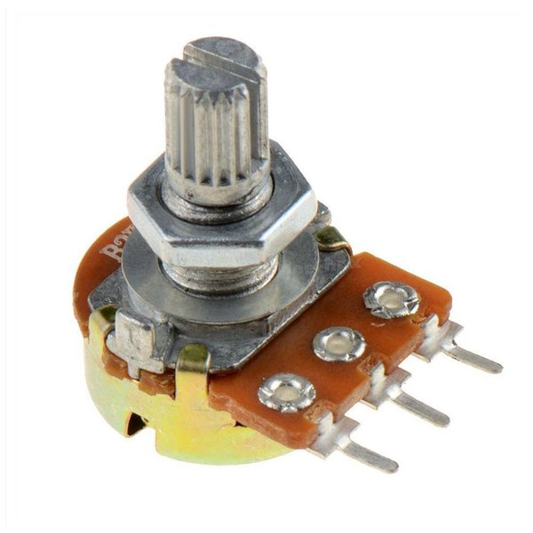

10. ### LCD1602液晶顯示IIC/I2C介面

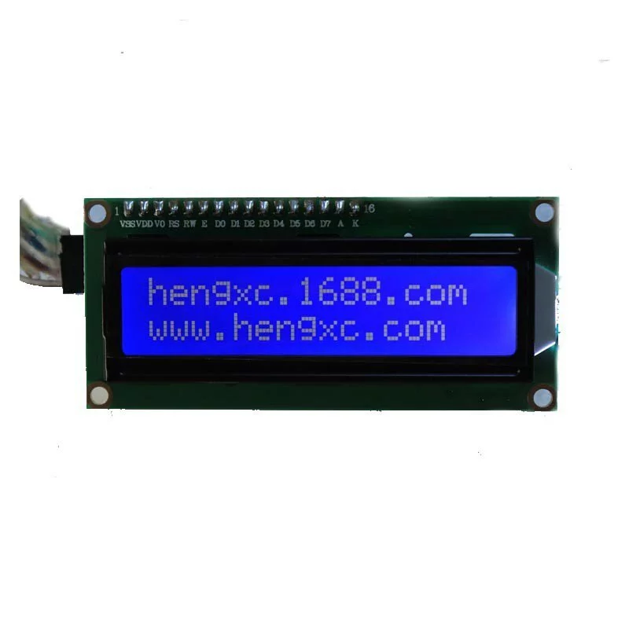
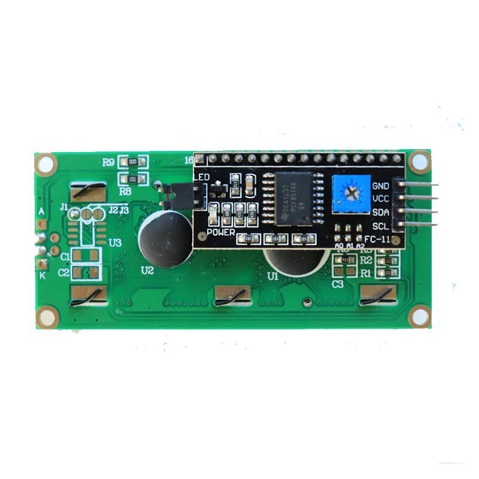

11. ### 光敏電阻 5mm

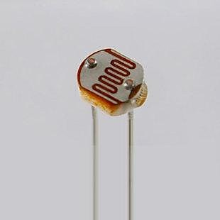

12. ### DHT11 溫度,濕度,酷熱度(支援3.3V)
 
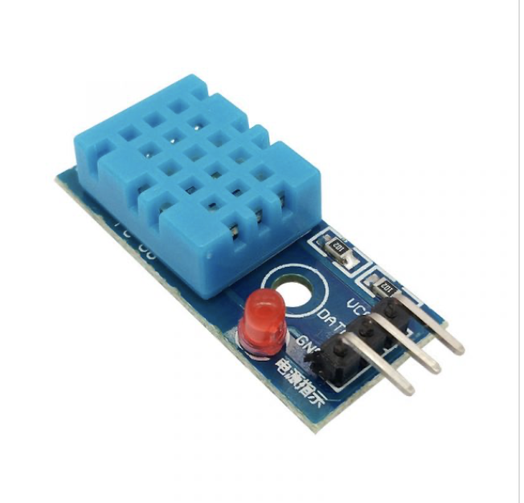

13. LED 5mm 紅
14. LED 5mm 綠
15. LED 5mm 黃

16. IC 74HC595

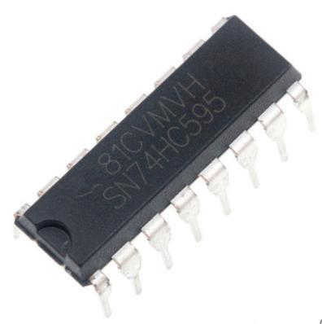

17. 5mm RGB 3色 共陰 (4pin)

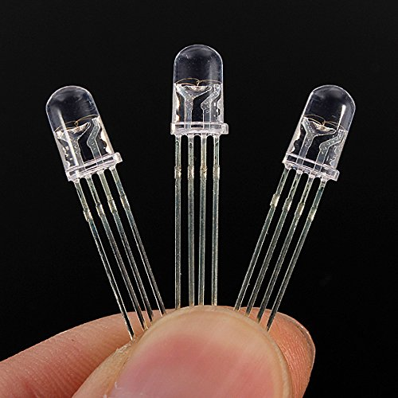

18. 7段顯示器 0.56" 共陰

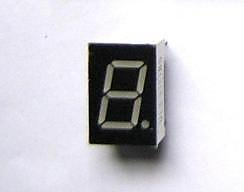

19. 超音波 HC-SR54

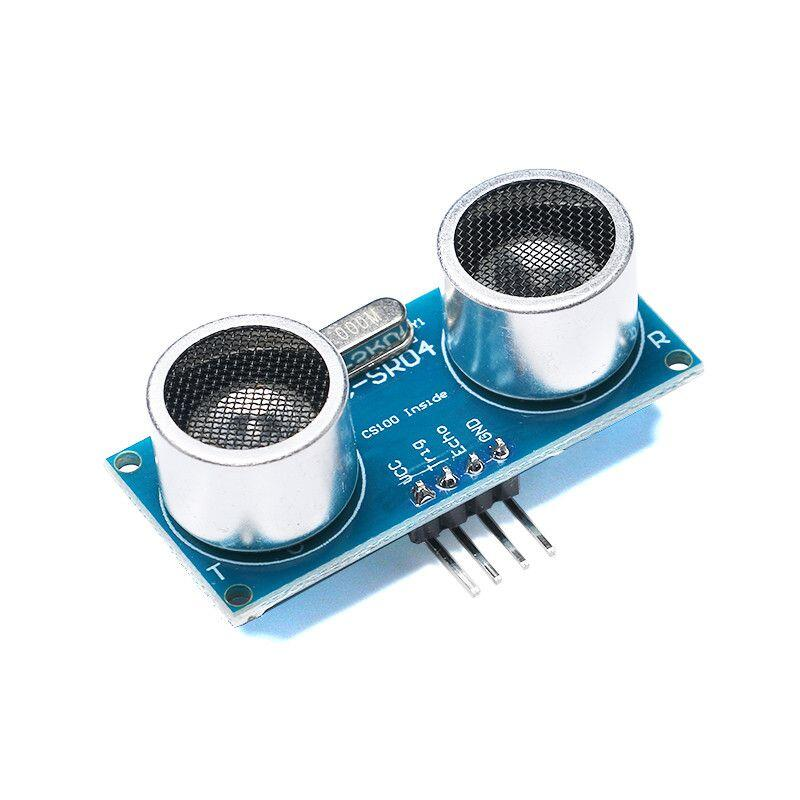

20. MFRC522 RFID(購買要pin腳已經焊好)

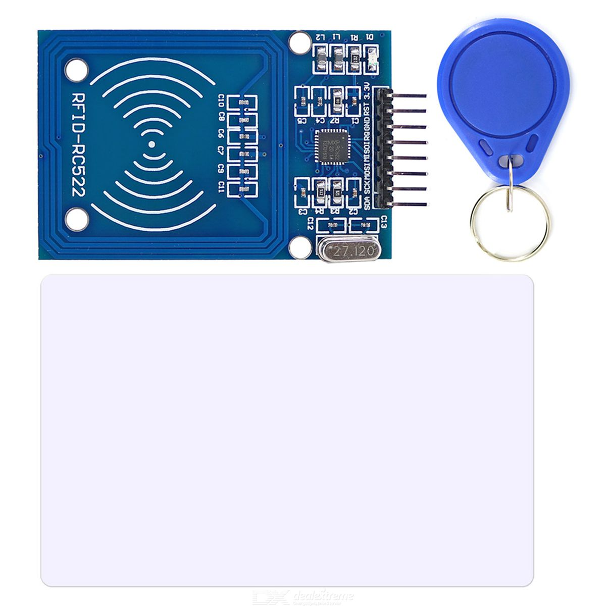

21. 迷你磁簧開關

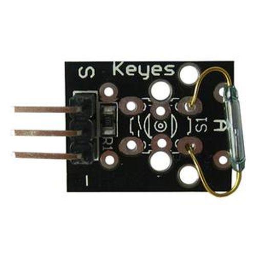
